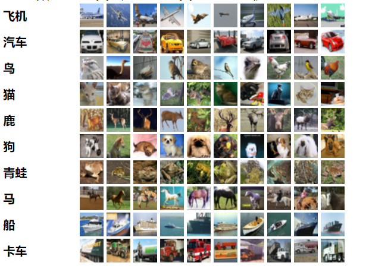
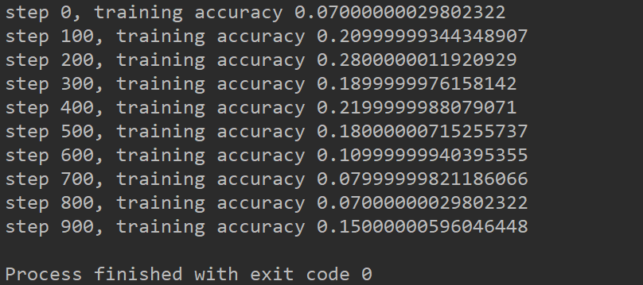

# CNN识别CIFAR-10数据集
## 1. 数据集介绍  
[CIFAR-10数据集](http://www.cs.toronto.edu/~kriz/cifar.html)包含10个类别的60000个32x32彩色图像，每个类别6000个图像。有50000张训练图像和10000张测试图像。数据集分为五个训练批次和一个测试批次，每个批次具有10000张图像。  
测试批次包含每个类别中恰好1000张随机选择的图像。训练批次按随机顺序包含其余图像，但是某些训练批次可能包含比另一类更多的图像。在它们之间，培训批次精确地包含每个类别的5000张图像。  
  
从其官方网站，下载python版本的数据集放入我们的项目目录中，然后就可以进行实验了。
## 2. 隐藏层模块  
因为我们使用的是tensorflow的基础API，要是建立一个多层网络的话，会重复写许多代码，所以我们首先将生成卷积层、池化层、全连接层等函数放在一个模块中，之后从这个模块调用函数就可以了。  
**在`layers.py`模块中，有下列这些函数**：  

- weight_variable(shape):生成初始权重，传入形状即可，里面用到了tf.truncated_normal函数，这个函数是生成截断式的正态分布随机数，据说在深度学习中比用tf.random_normal效果更好。  
- bias_variable(shape):生成偏差，也是传入形状即可，偏差值是固定的0.1。  
- conv2d(x, W):对tf.nn.conv2d(x, W, strides=[1, 1, 1, 1], padding='SAME')的封装，调用函数书写方便，而且把卷积核的步长也固定了为1步，零填充为'SAME'，这两个参数这样设置后，传入的X第1维和第2维的大小经过卷积后也不会变，使得我们免于计算卷积后的形状大小。  
- max_pool_2x2(x):对tf.nn.max_pool(x, ksize=[1, 2, 2, 1], strides=[1, 2, 2, 1], padding='SAME')，调用函数书写方便，池化器的大小为2X2，步长也固定了为2步，零填充为'SAME'，这样设置后，传入的x第1维和第2维的大小经过池化后会变为原来大小的一半，使得我们容易得出池化后的形状大小。  
- conv_layer(input, shape):按照shape参数生成权重参数和偏差，然后以这些权重参数和偏差对Input进行卷积，调用了上面定义的weight_variable(shape)、bias_variable(shape)和conv2d(x, W)函数，然后最后还对卷积后的输出用Relu函数进行激活，相当于卷积层后加了一个激活层，然后返回这个激活后的数据。  
- full_layer(input, size):按照Input数据的形状第一维数字和size参数生成权重，按照size参数生成偏差，然后返回input与权重的矩阵相乘结果加上偏差。  
## 3. 导入数据  
当要训练的数据量很大的时候，无法一次导入内存，我们就需要分批次的导入数据，这时候就需要用到tensorflow的QueueRunner技术了。  
在`cnn_cifar.py`模块中，read_picture函数就是对这个技术的应用：  

- QueueRunner分为三步：将文件名存入读取队列、读取与解码、批处理。  
- 将文件名导入队列需要用到tf.train.string_input_producer函数。  
- 因为cifat10数据集是二进制文件，所以我们用tf.FixedLengthRecordReader函数读取，并输入字节大小解码，cifat10数据集一个样本的字节大小为：一个代表类别的1位数字+一张图片字节，因为这个图片的像素形状是[3, 32, 32]，所以总字节大小为1+3*32*32。  
- 之后就是解码二进制数据，然后将标签和图片进行切片。
- 标签需要转为one_hot编码，图片需要转换形状，原来是[3, 32, 32],转换后要变为[32, 32, 3]  
- 然后就可以将解码并转换后得数据放入批处理队列了，这里批处理的大小设置为100。当然也可以往大了设置，看电脑的性能而定。  
## 4. 神经网络设计  
在`cnn_cifar.py`模块中，我们在get_y_predict函数建立了一个卷积层+激活层+池化层+卷积层+激活层+池化层+全连接层+激活层+dropout层+全连接层的神经网络：  

- 这个网络中需要注意的是每次经过一个层，数据形状是怎么变化的。刚开始输入是[100,32,32,3],经过第一层卷积之后，变为[100,32,32,32],再经过第一层池化后，变为[100,16,16,32]，再经过第二层卷积之后，变为[100,16,16,64],再经过第二层池化后，变为[100,8,8,64]。  
- 此时要经过全连接层，所以我们要将数据变为二维，结果变为[100, 8*8*64]。  
- 经过全连接层和激活层之后，这里加入了一个dropout层，是为了防止网络过拟合，所以随机抛弃一些节点，再跟最后一层全连接层做计算。  
- 最后一层全连接层为10个节点，因为我们要预测10个类别。  
## 5. 运行网络  
在将tensorflow的张量和操作设计好后，我们就可以在会话中运行网络了。  
在会话中需要注意的是，因为我们是使用QueueRunner技术来读取数据的，所以需要在会话中将线程开启，由这两句代码实现：coord = tf.train.Coordinator()、threads = tf.train.start_queue_runners(sess=sess, coord=coord)。  
最后还要关闭线程，由这两句代码实现：coord.request_stop()、coord.join(threads)。
## 6. 训练结果  
因为我们每次迭代只训练100个图片数据，迭代次数为1000次，所以训练结果不太好。
  
得到了百分之15的准确率，为了提升准确率，可以考虑更换优化器，调整学习率，增加批处理大小和迭代次数。